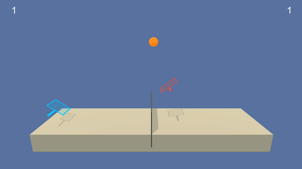

This repo is a solution to [Udacity Deep Reinforcement Learning Nano Degree](https://udacity.com/course/deep-reinforcement-learning-nanodegree--nd893) project [Colab and Compete](https://github.com/udacity/deep-reinforcement-learning/tree/master/p3_collab-compet)

## Project Details



Interestingly the agent has discovered the dexterity of a **double shot** in Tennis.


- **Environment:** Two agents control rackets to bounce a ball over a net. 
- **Goal:** Each agent should keep the ball in play.
- **Reward:** 
    * **+0.1:** When an agent hits the ball over the net.  
    * **-0.01:** When an agent lets a ball hit the ground or hits the ball out of bounds.
- **State space:** 8*3 variables corresponding to position and velocity of the ball and racket. Each agent receives its own, local observation.
- **Action space:** 2 continuous values, corresponding to movement toward (or away from) the net, and jumping.
- **Solved:** When agents gets an average score of +0.5 (over 100 consecutive episodes, after taking the maximum over both agents).

## Getting Started

### Installation

##### 1. Setup Python 3 

###### MacOS
```shell
brew install python3 swig && \
    brew install opencv3 --with-python && \
    pip3 install --upgrade pip setuptools wheel
```

###### Ubuntu
```shell
sudo apt-get install swig python3 python3-venv
```

##### 2. Setup Virtual Environment
```shell
python3 -m venv .venv && \
    source .venv/bin/activate && \
    pip install -r requirements.txt
```

### Unity environments

1. Download ["Tennis"](https://github.com/RitwikSaikia/drlnd_p2_continuous_control/releases/tag/unity-envs) environment based on your machine.
    - Linux: [click here](https://s3-us-west-1.amazonaws.com/udacity-drlnd/P3/Tennis/Tennis_Linux.zip)
    - Linux Headless: [click here](https://s3-us-west-1.amazonaws.com/udacity-drlnd/P3/Tennis/Tennis_Linux_NoVis.zip)
    - Mac OSX: [click here](https://s3-us-west-1.amazonaws.com/udacity-drlnd/P3/Tennis/Tennis.app.zip)
    - Windows (32-bit): [click here](https://s3-us-west-1.amazonaws.com/udacity-drlnd/P3/Tennis/Tennis_Windows_x86.zip)
    - Windows (64-bit): [click here](https://s3-us-west-1.amazonaws.com/udacity-drlnd/P3/Tennis/Tennis_Windows_x86_64.zip)
2. Place the file in the `env` directory, and unzip the file. 

## Usage

##### 1. Switch to Virtual Environment 
```shell
source .venv/bin/activate
```

##### 2. Train the Agent
```shell
python3 train.py
```

##### 3. Watch the Agent 

Required checkpoints are already available in [checkpoints/](checkpoints/) directory.

```shell
python3 test.py
```
