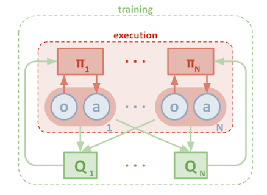
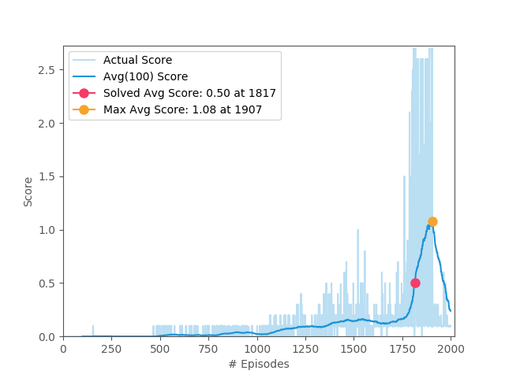

The solution to this project is based on [OpenAI : Multi Agent DDPG](https://arxiv.org/pdf/1706.02275) algorithm.

## Learning Algorithm

**MADDPG** is a general-purpose multi-agent learning algorithm that: 
1. Leads to learned policies that only use local information (i.e. their own observations) at execution time.
2. Does not assume a differentiable model of the environment dynamics or any particular structure on the communication method between agents.
3. Applicable not only to cooperative interaction but to competitive or mixed interaction involving both physical and communicative behavior.

   

The crux of the **MADDPG** algorithm is:

Allow the policies to use extra information to ease training, so long as this information is not used at test time. 
It is a simple extension of DDPG Actor Critic algorithm, where the critic is augmented with extra information about 
the policies of other agents, in this case, is combination of all states and actions of all agents.

* for `episode = 1 to M` do
     * Initialize a random process **Ν** [OUNoise(noise.py)](noise.py) for action exploration
     * Receive initial state **S**
     * for `t = 1 to max-episode-length` do   
        * for each agent `i`, select action `aⁱ` wrt to current Actor and exploration noise **N**
        * Execute actions `A` = `(a⁰, a¹, . . . , aⁿ)` and observe reward **R** and new state **S′**
        * Store `(S, A, R, S′)` in replay buffer **D**
        * `S ← S′`
        * for `agent i=1 to N` do
            * Sample a random minibatch of *E* examples `(Sₔ , Aₔ , Rₔ , S′ₔ )` from **D**
            * Compute the value estimate based on the examples and current critic
            * Update critic by minimizing the loss
            * Update actor using the sampled policy gradient
        * Update target network parameters for each agent `i` with `tau = 0.01`        

## Model

The **ActorCriticModel** used in the algorithm comprises of
* [PolicyModel\(model.py\)](model.py#L7) acting as an Actor:
   - It predicts actions given a state.
   - Input layer has a size of `num_states = 24`
   - Three FC hidden layers of size `(256, 128, 64)` each gated by `relu`
   - Output layer of size `num_actions = 2` gated by `tanh`
* [ValueModel\(model.py\)](model.py#L27) acting as a Critic:
   - It predicts an estimate of the discounted return from the given state onward.
   - Input layer has a size of `num_states = 52 (24 for states + 2 for actions) * 2 agents`
   - Three FC hidden layers of size `(256, 128, 64)` each gated by `relu`
   - Output layer of size `1` gated by `tanh`

## Hyperparameters

```python
buffer_size                 = int(1e6)
optimizer                   = Adam
lr_actor                    = 1e-4
lr_critic                   = 1e-3
gamma                       = 0.95
tau                         = 0.01
batch_size                  = 128
num_episodes                = 2000
max_steps                   = 1000
steps_per_update            = 2
exploration_range           = (0.3, 0.0)
num_exploration_episodes    = 25000
```

## Plot of rewards
The environment is solved in 1817 episodes, and a maximum score of 1.08 was achieved in 1907 episodes.



### Logs

[Full log file](docs/train.log)

```
...
INFO:train.py:Episode 1813/2000: eps: 0.278, Score: 2.600, Avg Score: 0.480, Best Avg Score: 0.480, Steps: 1000
INFO:train.py:Episode 1814/2000: eps: 0.278, Score: 0.000, Avg Score: 0.478, Best Avg Score: 0.480, Steps: 4
INFO:train.py:Episode 1815/2000: eps: 0.278, Score: 0.090, Avg Score: 0.478, Best Avg Score: 0.480, Steps: 30
INFO:train.py:Episode 1816/2000: eps: 0.278, Score: 0.100, Avg Score: 0.476, Best Avg Score: 0.480, Steps: 32
INFO:train.py:Episode 1817/2000: eps: 0.278, Score: 2.600, Avg Score: 0.501, Best Avg Score: 0.501, Steps: 1000
Solved in 1817 episodes
...
```

## Ideas of future work

As part of the previous project implementation [P2 Continuous Control](https://github.com/RitwikSaikia/drlnd_p2_continuous_control/Report.md), 
I have explored state of the art [PPO](https://github.com/RitwikSaikia/drlnd_p2_continuous_control) algorithm for single agent system.

The paper for **Multi Agent PPO** algorithm is not yet released, but in parts the approach is mentioned in 
   * [OpenAI Five Blog](https://blog.openai.com/openai-five/)
   * [OpenAI Learning Dexterity Blog](https://blog.openai.com/learning-dexterity/)
   
I tried extending the previous PPO implementation based on **MADDPG** and above mentioned articles, performance was bad and training wasn't converging. 

Hence the future work will be to solve the current **Unity Tennis** environment as well as [Multi-Agent Particle Environment](https://github.com/openai/multiagent-particle-envs)
using the **Multi Agent PPO** algorithm. 

## Reference Papers
* [Multi-Agent Actor-Critic for Mixed Cooperative-Competitive Environments](https://arxiv.org/pdf/1706.02275)

## Credits

* [OpenAI / MADDPG](https://github.com/openai/maddpg)
* [OpenAI / DDPG baseline](https://github.com/openai/baselines/tree/master/baselines/ddpg)
* [OpenAI / MultiAgent Particle Environments](https://github.com/openai/multiagent-particle-envs)
* [floodsung / DDPG](https://github.com/floodsung/DDPG)
* [floodsung / OUNoise](https://github.com/floodsung/DDPG/blob/master/ou_noise.py)
* [shariqiqbal2810 / maddpg-pytorch](https://github.com/shariqiqbal2810/maddpg-pytorch)
* [google / maddpg-replication](https://github.com/google/maddpg-replication)

